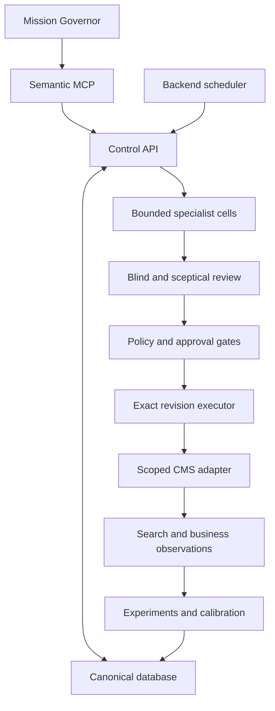

# Architecture

Work supervises strategy and exceptions. PostgreSQL owns canonical operational state; the backend worker owns scheduling. The Python executor alone can dispatch the supported CMS operations. Conversation history, crawled text and generated prose have no authority to change policy.

The control service implements ingest → deterministic diagnosis → bounded interpretation → concrete proposal where supported → guarded queue → measurement. Fixture reasoning returns NO-ACTION, rather than impersonating a live model. A live title recommendation can produce a concrete, extractively grounded title revision and a second review of its exact before/after snapshots. Other model recommendations remain structured proposals for a scoped human draft.

## Boundaries

| Boundary | Implementation |
| --- | --- |
| Trusted configuration | Distinct administrator token; typed business definition, price bound and brand-fact routes; no generic configuration patch |
| Observation provenance | Collector creates evidence IDs, hashes, source/type, owner, observation time and fixture flag; webpage text cannot assign trust |
| Agent invocation | Task contract, bounded JSON evidence, no tools/handoffs, explicit model, timeout, SDK retry disabled, durable reservation before the call |
| Independent verification | Blind diagnosis first; exact revision target only in final challenge; correlated model error remains a limitation |
| Admission | Deterministic risk and allowed-field checks; exact revision hash, independent verifier, current human veto/approval, quality and experiment gates |
| Dispatch | Committed intent and prediction; non-expiring page execution lease; locked site policy and atomic CMS precondition; readback |
| Measurement | Coverage/definition/freshness checks; immutable analysis evidence; unknown forecasts stay unknown; no automatic causal conclusion |

## Concurrency and recovery

`site-cycle:{site_id}` is the shared lease for control cycles and scheduled observation jobs. Acquisition is committed before work. A heartbeat renews it; every protected commit conditionally renews under a database lock, fencing out stale workers. Site-row locking serialises paid model reservations. One stable invocation ID cannot be rebound or refunded after a crash.

Page execution leases are a different mechanism. They do not expire automatically: a timeout may mean a CMS write succeeded. A read-only reconciliation checks exact approved state before releasing the lease. An unexpected state remains a human exception. Job idempotency prevents retrying a crashed paid cycle under the same key; inspect it and create a deliberate new attempt when appropriate.

PostgreSQL is the production concurrency authority. SQLite's single-process demo verifies logic, not equivalent row-lock semantics. Audit-table grants and triggers supplement application checks. Database administrators still control the schema and are outside application-level tamper protection.

## Deliberate structure choices

Closely related models share one explicit SQLAlchemy module and a frozen initial migration, avoiding empty packages for every conceptual entity. Deterministic detectors share `seo/analysis.py`. Specialist roles share a manager runtime with named contracts, rather than independent chat loops. `seo_mcp` avoids shadowing the third-party `mcp` package. The dashboard uses static assets so it does not compete with the control plane for implementation effort.

SERP/AI clients are isolated paid adapters. Automatic collection and cross-provider causal comparison await an explicit query/locale/budget policy. A real OAuth issuer, HTTPS ingress and Work connector registration are deployment dependencies, not capabilities assumed to exist inside the SDK.
